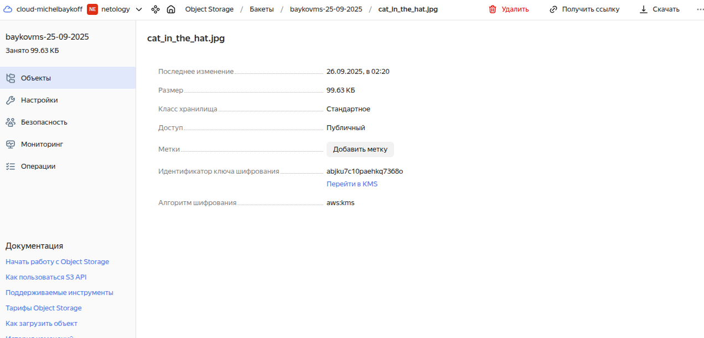

# Домашнее задание к занятию «Безопасность в облачных провайдерах» -- Байков Михаил

## Задание 1. Yandex Cloud   

1. С помощью ключа в KMS необходимо зашифровать содержимое бакета:

 - создать ключ в KMS;
 - с помощью ключа зашифровать содержимое бакета, созданного ранее.

 ### Решение 1
 1. Для выполнения этого задания возьмем за основу код из предыдущего задания. Допишем создание ключа в KMS и включение шифрации. Код:[crypto.tf](terraform/crypto.tf)
   - применяем наш код и смотрим результат. Ключ в KMS создался, файл зашифрован.
     
   